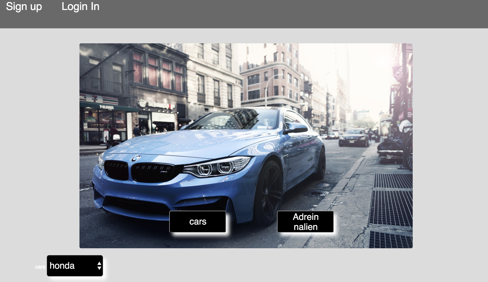
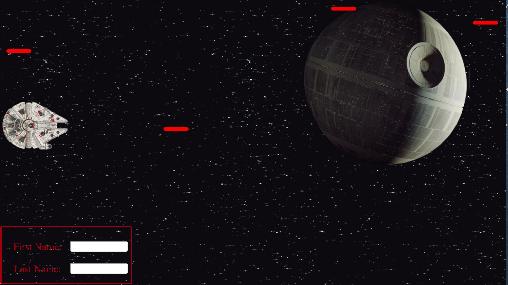
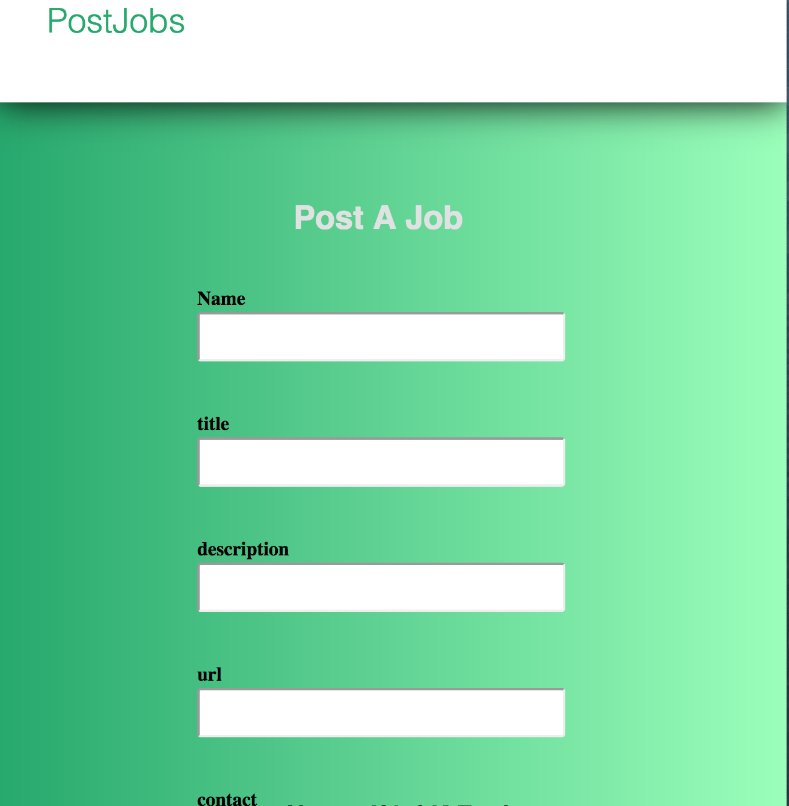

# Portfolio.github.io
Portfolio website

// FIRST TEMPLATE CODE //
<!-- 
<!DOCTYPE html>
<html>
<head>
 <link rel="stylesheet" href="http://www.w3schools.com/lib/w3.css">
  <link rel="stylesheet" href="https://cdnjs.cloudflare.com/ajax/libs/font-awesome/4.6.3/css/font-awesome.min.css">
  <link rel="stylesheet" type="text/css" href="style.css">
  <link href="https://fonts.googleapis.com/css?family=Poiret+One" rel="stylesheet">

<meta name="viewport" content="width=device-width, initial-scale=1"> -->

<!-- <link href="https://fonts.googleapis.com/css?family=Poiret+One|Rajdhani" rel="stylesheet">
 -->
<!--   <link href="https://fonts.googleapis.com/css?family=Ubuntu" rel="stylesheet">
  
  
  <meta charset="utf-8">
 -->
 <!--  <meta http-equiv="X-UA-Compatible" content="IE=edge">
  <title>JohnEspinoza</title>
 </head>
<body>

    <a href="javascript:void(0)" style="color:#088A29" class="closebtn" onclick="closeNav()">&Ouml;</a>
       

          <header id="header">
             

           <h3>Full-Stack Developer</h3>
              <a href="https://www.linkedin.com/in/john-espinoza" style="font-size:42px"><i class="fa fa-linkedin"></i></a>
              <a href="mailto:johne3741@gmail.com" style="font-size:42px"><i class="fa fa-envelope"></i></a>
              <a href="https://github.com/johnlovespi" style="font-size:42px"><i class="fa fa-github" aria-hidden="true"></i></a>
              <a href="http://codepen.io/JOHNESPINOZA/" style="font-size:42px"><i class="fa fa-codepen" aria-hidden="true"></i></a> 

              
<strong>" i’ve become accomplished in many different libraries and frameworks and being able to develop full-stack web applications. I thoroughly enjoy challenging myself, learning new things and solving complex problems, it gives me a great sense of accomplishment. "</strong>

             <h1>JOHN ESPINOZA</h1>
          </header>
       

       

        
        
        
    

   &raquo;
          <h1 id="r-text">Experience</h1>
            
GENERAL ASSEMBLY" Web Development Immersive

            
Hack-Athon 2015 Lehman College

            
Living In New York 

            
Motorcyclist Enthusiast 

<

      <h2 id="w-text">Portfolio</h2>
         
         
         

Bages

 <!--  <h2>Bages</h2> -->
<!--   

  <ul>
    <li><a href="" class="btn btn-5">HTML</a></li>
    <li><a href="" class="btn btn-5">CSS</a></li>
    <li><a href="" class="btn btn-5">React</a></li>
    <li><a href="" class="btn btn-5">Node.js</a></li>
    <li><a href="" class="btn btn-5">JS</a></li>
    <li><a href="" class="btn btn-5">PostgreSQL</a></li>
    <li><a href="" class="btn btn-5">Jquery</a></li>
  </ul> -->

<!--   

      
<strong>Get In</strong>touch

        <input class="user" type="text" name="First_name" placeholder="Your name">
        <input class="user" type="text" name="Last_name" placeholder="Email">
        <input class="user" type="text" name="Email" placeholder="Subject">
        <input class="usertext" type="text" name="Text" placeholder="Your Message">
          
        <button type="">Submit</button>
           
      <a href="https://www.linkedin.com/in/john-espinoza" style="font-size:30px;margin-left: 282px;margin-top: 20px;"><i class="fa fa-linkedin"></i></a>
      

    

 -->
<!-- Our hamburger button -->

<!-- </body> -->

  
</html>
